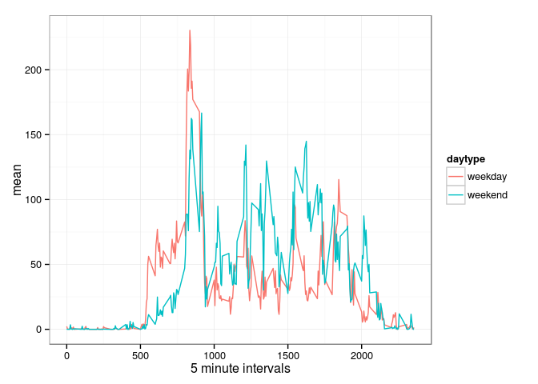

# Reproducible Research: Peer Assessment 1


## 1. Loading and preprocessing the data

```r
if (!file.exists("data")) {
  message("Creating data directory")
  dir.create("data")
  
  if (!file.exists("data/data.zip")) {
    # download the data
    fileURL <- "https://d396qusza40orc.cloudfront.net/repdata%2Fdata%2Factivity.zip"
    zipfile="data/data.zip"
    message("Downloading data file")
    download.file(fileURL, destfile=zipfile, method="curl")
    message("Unzipping data file")
    unzip(zipfile, exdir="data")
  }
}
data <- read.csv("data/activity.csv", stringsAsFactors = FALSE)
```
#### 1a Convert to a data table

```r
dt <- data.table(data)
```

#### 1b Convert Date String to Date

```r
dt$date <- as.Date(dt$date, "%Y-%m-%d") 
```

## 2. What is mean total number of steps taken per day?

```r
#Get Sum of all steps taken per day
steps.by.date <- dt[,list(total = sum(steps, na.rm=TRUE)), by=date]
#Mean
steps.by.date.mean <- mean(steps.by.date$total, na.rm=TRUE)
#Median
steps.by.date.median <- median(steps.by.date$total, na.rm=TRUE)
```

steps.by.date.mean | steps.by.date.median
------------------ | --------------------
9354.2295082 | 10395


```r
hist(steps.by.date$total, breaks = nrow(steps.by.date), xlab="", main="Total Steps per day")
```

 

## 3. What is the average daily activity pattern?

```r
steps.by.interval <- dt[,list(mean = mean(steps, na.rm=TRUE)), by=interval]
plot(steps.by.interval, type="l", ylab="Average Number of Steps", xlab="5 minute intervals")
```

 

#### 3a Which 5-minute interval, on average across all the days in the dataset, contains the maximum number of steps?

```r
maxsteps <- steps.by.interval[steps.by.interval$mean==max(steps.by.interval$mean),]
print(maxsteps)
```

```
##    interval     mean
## 1:      835 206.1698
```


## 4. Imputing missing values

#### 4a Calculate and report the total number of missing values in the dataset

```r
sum(is.na(dt))
```

```
## [1] 2304
```


```r
#Merge original dataset with steps.by.interval data steps.by.interval has calculated Mean
augmented.data <- merge(dt, steps.by.interval, by="interval")

#Select all NA's and replace with the rounded MEAN steps
augmented.data$steps[is.na(augmented.data$steps)] <- round(augmented.data$mean[is.na(augmented.data$steps)])

#drop mean column as we're done with it
augmented.data$mean <- NULL

#Get Sum of all steps taken per day
augmented.data.by.date <- augmented.data[,list(total = sum(steps)), by=date]
#Augmented Mean
augmented.data.by.date.mean <- mean(augmented.data.by.date$total)
#Augmented Median
augmented.data.by.date.median <- median(augmented.data.by.date$total)
```
data | mean | median
------------------ | -------------------- | -----------------------
original data | 9354 | 10395
augmented data | 10765 | 10762
difference | 1411 | 367


```r
hist(augmented.data.by.date$total, breaks = nrow(augmented.data.by.date), xlab="", main="Total Steps per day (augmented data)")
```

 


What is the impact of imputing missing data on the estimates of the total daily number of steps?  
As far as I can tell, not a whole lot.

```r
hist(augmented.data.by.date$total-steps.by.date$total, breaks = nrow(steps.by.date), xlab="", main="Total Steps per day")
```

 


## 5. Are there differences in activity patterns between weekdays and weekends?

```r
#Create Factor to distinguish Weedat from Weekend
weekend <- weekdays(as.Date(augmented.data$date)) %in% c("Saturday", "Sunday")

#assign types
augmented.data$daytype <- "weekday"
augmented.data$daytype[weekend == TRUE] <- "weekend"

#coerce to factor
augmented.data$daytype <- as.factor(augmented.data$daytype)

#Convert to Data Table
daytype.data <- data.table(augmented.data)

#Organize data and calculate the MEAN
daytype.data <- daytype.data[,list(mean = mean(steps)), by="interval,daytype"]

#plot the data
ggplot(data=daytype.data, aes(x=interval, y=mean, group=daytype)) +  theme_bw() + geom_line(aes(color=daytype))+ facet_wrap(~ daytype, nrow=2) + labs(x="5 minute intervals")
```

 

```r
# Data comparison for Weekday/Weekend
ggplot(data=daytype.data, aes(x=interval, y=mean, group=daytype)) +  theme_bw() + geom_line(aes(color=daytype)) + labs(x="5 minute intervals")
```

 
